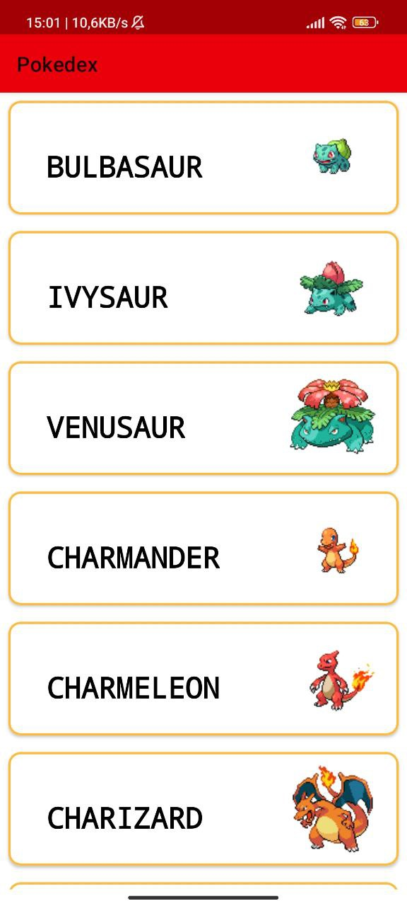

# Pokedex API Project

This project is a fork of [pokedex-api-old](https://github.com/ricardobar96/pokedex-api-old). The purpose of this fork is to migrate the whole code from [Java](https://www.java.com/en/) to [Kotlin](https://kotlinlang.org/). Also to remove all unnecessary classes and to optimize the code. The app it's designed to consume a Pokemon API and display the data in a RecyclerView.
Is built using [Android](https://www.android.com/).

## Table of Contents

- [Getting Started](#getting-started)
- [License](#license)

## Getting Started

To install the Pokedex on your local machine, follow these steps:

1. Clone this repository: `git clone https://github.com/enriqueseor/pokedex.git`
2. Open the project in Android Studio.
3. Build and Run de project.

## License

This project is licensed under the [MIT License](LICENSE).
